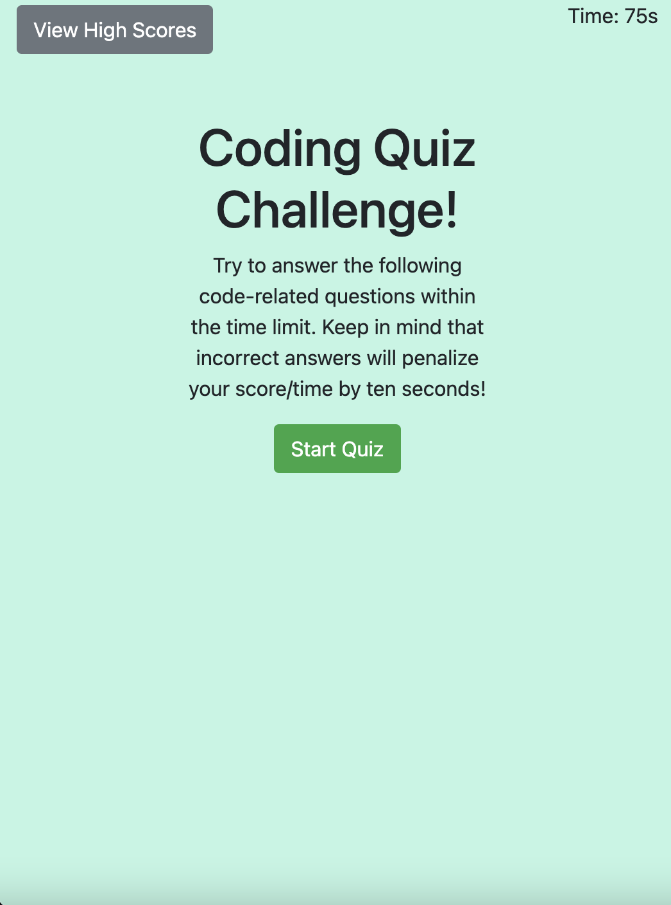

# Coding Quiz Challenge

## Description

This timed code quiz features multiple-choice questions about javascript. If answered incorrectly, time is deducted.

## User Story

```
AS A coding bootcamp student
I WANT to take a timed quiz on JavaScript fundamentals that stores high scores
SO THAT I can gauge my progress compared to my peers
```

## Acceptance Criteria

```

Once the start button is clicked, the question is presented, and the timer starts
When a question is answered then another question is presented
The time is subtracted from the clock if answer a question incorrectly.
The game is over when all questions are answered or the timer reaches 0
Initials and score can be saved once the game is over.

```

## Screenshots




[Deployed Application]()
